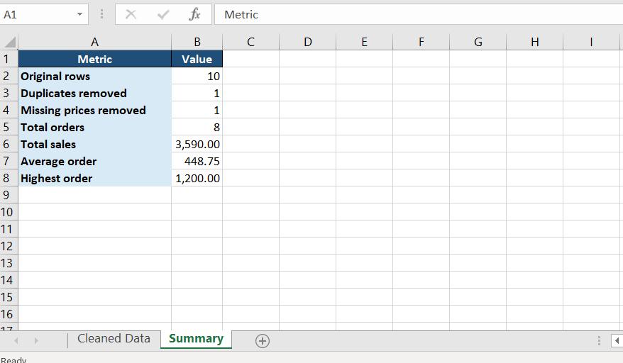

# Smart Excel Sales Automation

A Python automation tool that reads multiple Excel sales files, validates and cleans the data, performs sales analysis, and automatically generates a formatted Excel report.

## Features

- Automatically detects multiple Excel files
- Combines sales data from multiple files
- Validates required columns
- Detects invalid numeric data
- Ignores temporary Excel files
- Removes duplicate records
- Handles missing price values
- Calculates total value for each order
- Generates sales statistics
- Creates a formatted Excel report
- Adds Excel filters
- Automatically formats numeric values
- Generates separate Cleaned Data and Summary sheets

## Technologies Used

- Python
- Pandas
- OpenPyXL
- Microsoft Excel
- Git
- GitHub

## Project Structure

```text
smart-excel-sales-automation/
│
├── input/
│   ├── sales_january.xlsx
│   └── sales_february.xlsx
│
├── output/
│   └── final_sales_report.xlsx
│
├── screenshots/
│   └── sales_summary.png
│
├── main.py
├── README.md
└── .gitignore
```

## Example Output

The generated Excel report includes a formatted sales summary.



## Input Format

The input Excel files should contain the following columns:

| Column | Description |
|---|---|
| Name | Customer name |
| Email | Customer email |
| Product | Product name |
| Quantity | Number of products ordered |
| Price | Price per unit |

## How It Works

The application follows this workflow:

```text
Multiple Excel Files
        ↓
File Detection
        ↓
Data Validation
        ↓
Data Combination
        ↓
Data Cleaning
        ↓
Sales Analysis
        ↓
Formatted Excel Report
```

## Data Validation

Before processing the files, the program checks:

- Whether Excel files exist in the input folder
- Whether all required columns are available
- Whether Quantity and Price contain valid numeric data
- Whether temporary Excel files should be ignored

If invalid input is detected, the program displays a readable error message.

## Data Cleaning

The program automatically:

- Removes duplicate rows
- Removes orders with missing prices
- Preserves orders with missing email addresses
- Calculates the total value of each valid order

The total value of each order is calculated as:

```text
Total = Quantity × Price
```

## Generated Report

The program generates the following file:

```text
output/final_sales_report.xlsx
```

The report contains two Excel sheets:

### Cleaned Data

Contains the validated, combined, and cleaned sales records.

### Summary

Contains automatically calculated metrics including:

- Original rows
- Duplicates removed
- Missing prices removed
- Total orders
- Total sales
- Average order value
- Highest order value

## Installation

Install the required Python packages:

```bash
pip install pandas openpyxl
```

## Usage

Place the Excel sales files inside the `input` folder.

Then run:

```bash
python main.py
```

The final Excel report will automatically be generated inside the `output` folder.

## Skills Demonstrated

This project demonstrates practical experience with:

- Python programming
- Pandas
- Excel automation
- Data validation
- Data cleaning
- Error handling
- Multi-file processing
- File handling with pathlib
- Automated reporting
- Excel formatting with OpenPyXL
- Git version control
- GitHub

## Author

Maedeh Sharifi